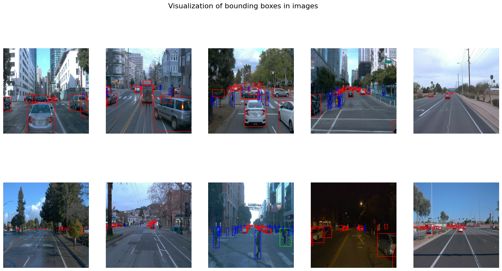
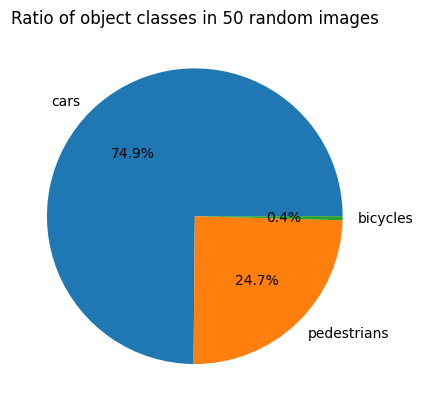

# Object Detection in an Urban Environment

### Project overview

In this project, we try to detect objects in images from Waymo Open Dataset. Object detection is an important component of self driving car systems, because it is the component which allows such systems to understand vehicle surroundings, such as pedestrians and other vehicles from camera observations.

### Set up

I used the Dockerfile in build came with the course material. I built the image with

    docker build -t project-dev -f Dockerfile .

then ran

    docker run --gpus all -v <PATH TO LOCAL PROJECT FOLDER>:/app/project/ --network=host -ti project-dev bash

Some libraries had to be downgraded due to library update, etc. These steps are reflected in Dockerfile.

In the Docker image, I ran the following to download the dataset:

    python download_process.py --data_dir /app/project/data

Then after implementing create_splits.py, I ran the following to split data.

    mkdir /app/project/split
    python create_splits.py --source /app/project/data /app/project/split

For training and evaluation, I followed the instruction of the course material.

### Dataset

#### Dataset analysis

In `Exploratory Data Analysis.ipynb`, I first visualized annotations in 10 random images in the dataset:

From visualized annotations, I could tell the following:

* The majority of objects are cars.
* There are many small objects in the images.
* There are many overlapping objects in the images.
  * Small objects and overlapping objects might make it difficult to effectively apply one stage detector.
* I didn't see any bicycles in the visualization of 10 images.
* There are many different lighting conditions in the dataset.

Then I visualized distribution of classes of 50 random images:

From the pie chart, I could confirm quantitatively that the impressions are correct: the majority of objects are cars and bicycles are very rare.

Then I visualized the distribution of bounding box sizes:

From the histogram, it became clear that actually the majority of bounding boxes has less than 5% area of the entire image.

#### Cross validation

With `create_splits.py`, I split the dataset into three: training (train), validation (val), test (test). The train set was used for training. The val set was used to compare models.

### Training

#### Reference experiment

| Metrics Name                          | Value    |
| ------------------------------------- | -------- |
| DetectionBoxes_Precision/mAP          | 0.049726 |
| DetectionBoxes_Precision/mAP@.50IOU   | 0.105540 |
| DetectionBoxes_Precision/mAP@.75IOU   | 0.042007 |
| DetectionBoxes_Precision/mAP (small)  | 0.021489 |
| DetectionBoxes_Precision/mAP (medium) | 0.130668 |
| DetectionBoxes_Precision/mAP (large)  | 0.271001 |
| DetectionBoxes_Recall/AR@1            | 0.016680 |
| DetectionBoxes_Recall/AR@10           | 0.058279 |
| DetectionBoxes_Recall/AR@100          | 0.110761 |
| DetectionBoxes_Recall/AR@100 (small)  | 0.068510 |
| DetectionBoxes_Recall/AR@100 (medium) | 0.236955 |
| DetectionBoxes_Recall/AR@100 (large)  | 0.432967 |
| Loss/localization_loss                | 0.533029 |
| Loss/classification_loss              | 0.546793 |
| Loss/regularization_loss              | 0.453309 |
| Loss/total_loss                       | 1.533131 |

Overall mAP are low. mAP gets lower as the bounding boxes get smaller.

Also, according to Tensorboard, total loss exploded right after the training started:

[Exploding loss for reference experiment](reference_tensorboard.png)

It indicates that the learning rate might be too high especially around the beginning.

#### Improve on the reference

##### experiment1

Changes from reference:

* Changed momentum optimizer to Adam, suspecting the optimizer might be causing the total loss explosion.
* Lower the learning_rate_base to 0.03 from 0.04

Result:

* The result actually worsened from reference. Although we did not see explosion in total loss this time, even mAP for larger objects became very low. In fact, I tried to create animation from this model but no object was detected. 

| Metrics Name                          | Value    |
| ------------------------------------- | -------- |
| DetectionBoxes_Precision/mAP | 0.001881 |
| DetectionBoxes_Precision/mAP@.50IOU | 0.008643 |
| DetectionBoxes_Precision/mAP@.75IOU | 0.000076 |
| DetectionBoxes_Precision/mAP (small) | 0.000609 |
| DetectionBoxes_Precision/mAP (medium) | 0.006674 |
| DetectionBoxes_Precision/mAP (large) | 0.027453 |
| DetectionBoxes_Recall/AR@1 | 0.002331 |
| DetectionBoxes_Recall/AR@10 | 0.007844 |
| DetectionBoxes_Recall/AR@100 | 0.032448 |
| DetectionBoxes_Recall/AR@100 (small) | 0.020147 |
| DetectionBoxes_Recall/AR@100 (medium) | 0.070295 |
| DetectionBoxes_Recall/AR@100 (large) | 0.109890 |
| Loss/localization_loss | 0.897523 |
| Loss/classification_loss | 0.710646 |
| Loss/regularization_loss | 0.048756 |
| Loss/total_loss | 1.656925 |

##### experiment2

* Added augumentations.
  * random_adjust_brightness, random_adjust_hue, random_adjust_saturation are added. In ETA many different lighting conditions were seen, so I expected them to replicate those conditions.
  * random_black_patches is added. In EDA objects were often occluded, so I expected them to replicate those conditions.
* Reverted back to momentum optimizer but substantially lowered learning rate. learning_rate_base: 0.001 warmup_learning_rate: 0.0003 

Result:

* This is the best model among three. Especially for large objects, we see mAP of ~0.82 and AR of ~0.84.
* For small objects however, detection still remains challenging. As expected during EDA, the model struggled to detect small objects. The problem might be mitigated by using two stage detectors instead.

| Metrics Name                          | Value    |
| ------------------------------------- | -------- |
| DetectionBoxes_Precision/mAP | 0.183033 |
| DetectionBoxes_Precision/mAP@.50IOU | 0.357934 |
| DetectionBoxes_Precision/mAP@.75IOU | 0.159025 |
| DetectionBoxes_Precision/mAP (small) | 0.096755 |
| DetectionBoxes_Precision/mAP (medium) | 0.463644 |
| DetectionBoxes_Precision/mAP (large) | 0.818684 |
| DetectionBoxes_Recall/AR@1 | 0.041746 |
| DetectionBoxes_Recall/AR@10 | 0.175257 |
| DetectionBoxes_Recall/AR@100 | 0.257493 |
| DetectionBoxes_Recall/AR@100 (small) | 0.180164 |
| DetectionBoxes_Recall/AR@100 (medium) | 0.539461 |
| DetectionBoxes_Recall/AR@100 (large) | 0.843956 |
| Loss/localization_loss | 0.317194 |
| Loss/classification_loss | 0.235581 |
| Loss/regularization_loss | 0.237745 |
| Loss/total_loss | 0.790520 |

Here's the loss change throughout the training shown in Tensorboard:

[Loss constantly getting lower](experiment2_tensorboard.png)

Unlike the reference model, I did not see any loss explosion at the beginning, although near the end of the training I saw very little change in loss.

In the animation generated from the model, I could see the majority of vehicles detected, although it is sometimes noticed that in some frames when vehicles are distant, they are undetected.

[Animation](animation2.gif)